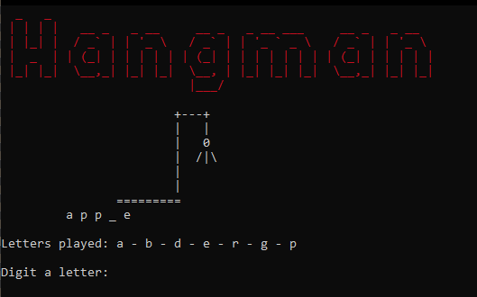
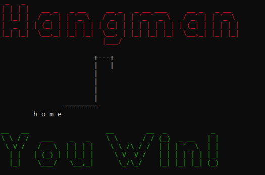
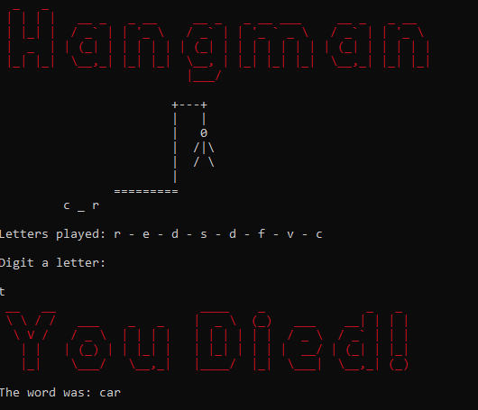

# Hangman
[](https://github.com/TheLe0/hangman/actions/workflows/test.yml)

A simple console implemantation of the hangman game.

To run the app you must have docker installed on your machine and run the following commands:

```bash
docker build -t hangman:latest .
docker run -it hangman:latest
```



If you input more than one character, you are trying to guess the word. Only one character longer input will search in the word, like the tradicional game.





